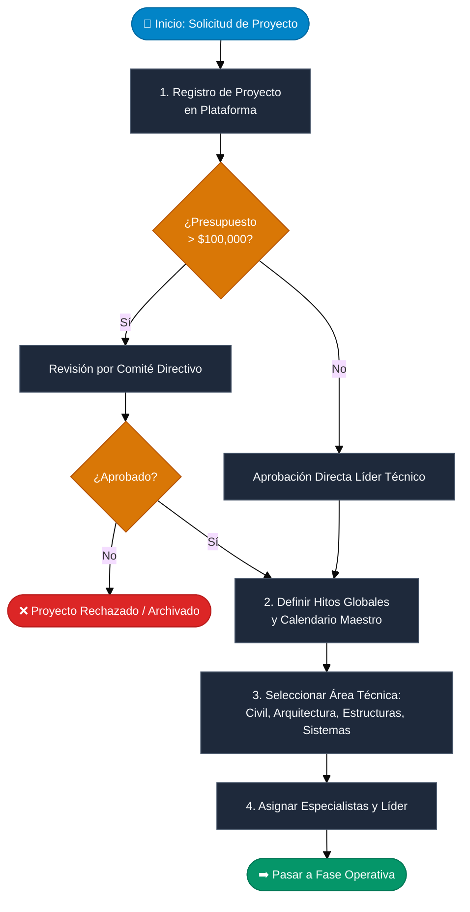
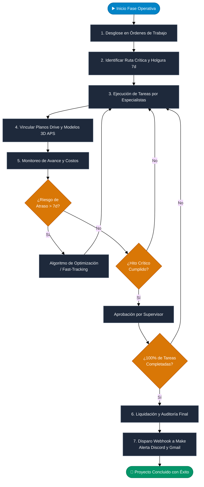
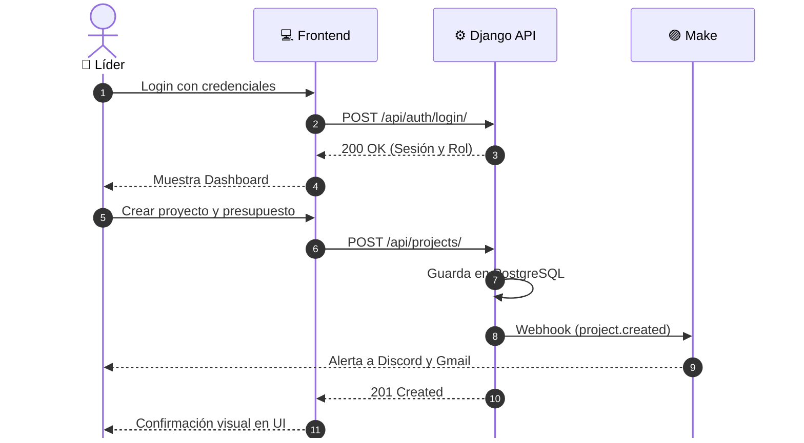
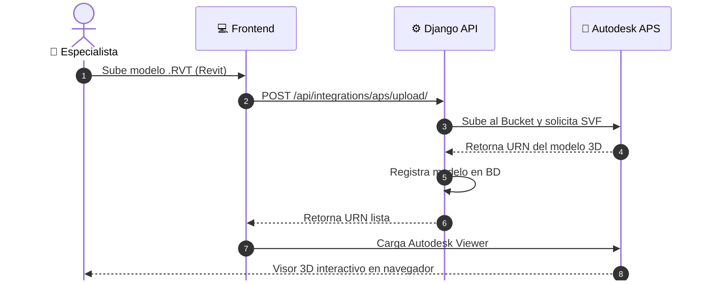
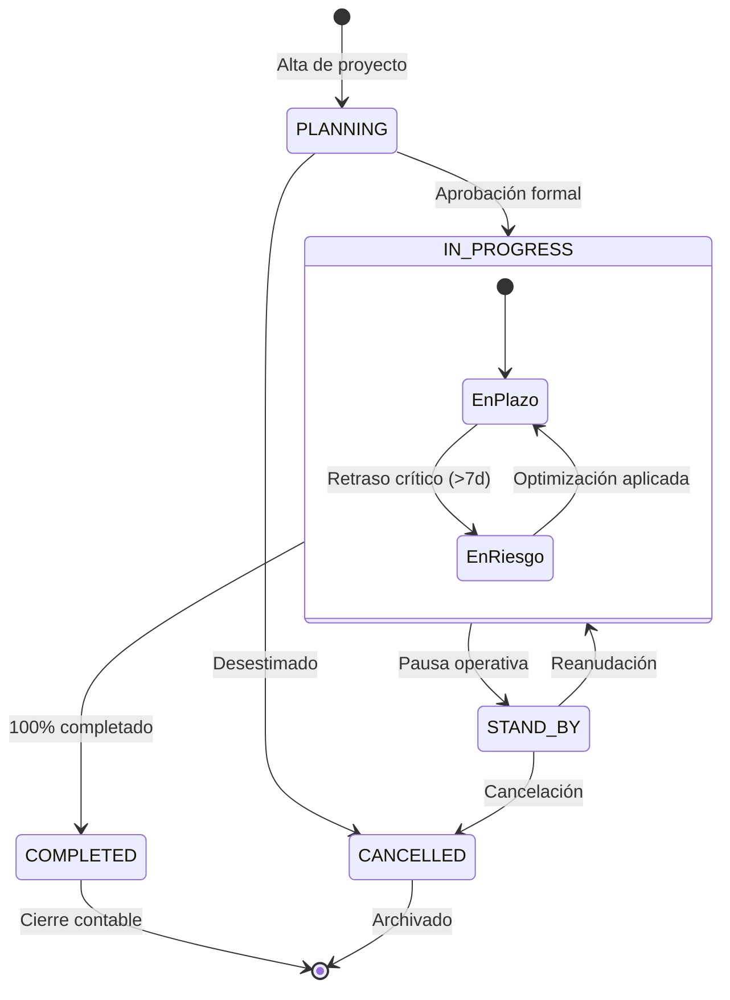
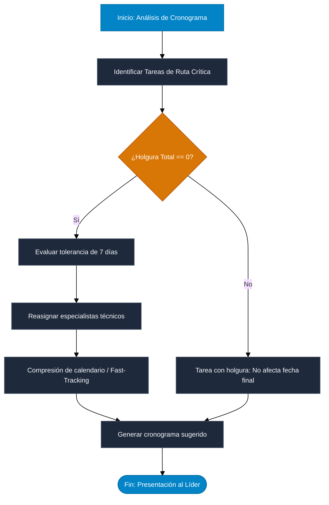

# 📊 Flujo de Negocio y Procesos — Project Planner

Este documento modela visualmente los procesos de negocio corporativos, la arquitectura de integración y el ciclo de vida del sistema **Project Planner** mediante diagramas estándar **Mermaid** estructurados para encajar perfectamente en exportación a **PDF (A4)**.

---

## 1. 🏢 Flujo de Negocio: Planificación y Aprobación (Fases 1 y 2)

Representa el ciclo desde la formulación inicial de la propuesta hasta la asignación de recursos y especialistas.

---

## 2. 🔨 Flujo de Negocio: Ejecución y Cierre (Fases 3 y 4)

Control de tareas en campo, verificación de ruta crítica, auditoría y cierre contable.

---

## 3. ⚡ Secuencia 1: Creación de Proyectos y Notificaciones Make

---

## 4. 📐 Secuencia 2: Documentación Drive y Visor BIM 3D (Autodesk APS)

---

## 5. 🔄 Ciclo de Vida del Proyecto (Estados)

---

## 6. 🧮 Algoritmo de Optimización de Cronograma (Ruta Crítica)

