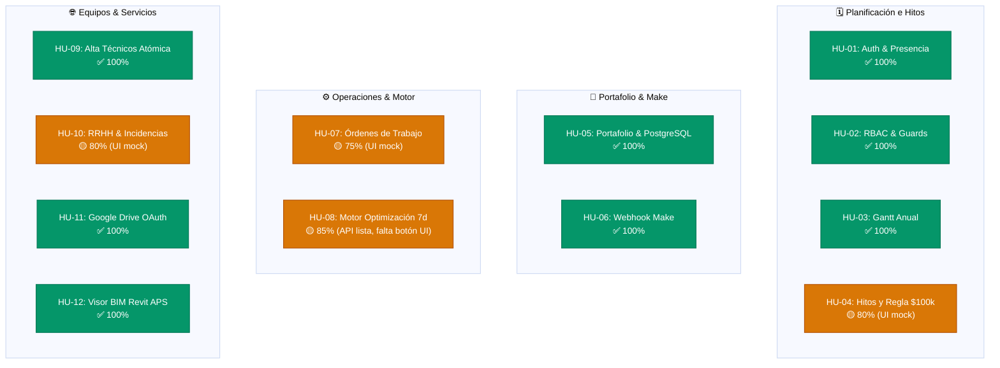

# 📋 Matriz de Historias de Usuario (HU) y Criterios de Aceptación — Project Planner

> **Proyecto:** Project Planner — Sistema de Planificación, Optimización y Gestión de Proyectos  
> **Versión:** 1.0.0  
> **Estado:** Fase Final de Validación y Cierre (DoD)  
> **Referencia Arquitectónica:** [`project_planner_architecture.pdf`](file:///home/ronaldo/Documentos/GitHub/PROJECT%20PLANNER/project_planner_architecture.pdf) · [`01. Flujo de Negocio y Procesos (Mermaid).md`](file:///home/ronaldo/Documentos/GitHub/PROJECT%20PLANNER/project-planner/docs/01.%20Flujo%20de%20Negocio%20y%20Procesos%20%28Mermaid%29.md) · [`02. Documentación API y Endpoints.md`](file:///home/ronaldo/Documentos/GitHub/PROJECT%20PLANNER/project-planner/docs/02.%20Documentaci%C3%B3n%20API%20y%20Endpoints.md) · [`03. Documentación Frontend.md`](file:///home/ronaldo/Documentos/GitHub/PROJECT%20PLANNER/project-planner/docs/03.%20Documentaci%C3%B3n%20Frontend.md)

---

## 📑 Índice de Épicas

1. [Épica 1: Autenticación, Seguridad y Control de Acceso (RBAC)](#1-épica-1-autenticación-seguridad-y-control-de-acceso-rbac)
2. [Épica 2: Planificación Estratégica y Calendario Maestro (Fases 1 y 2)](#2-épica-2-planificación-estratégica-y-calendario-maestro-fases-1-y-2)
3. [Épica 3: Portafolio de Proyectos y Automatizaciones Make](#3-épica-3-portafolio-de-proyectos-y-automatizaciones-make)
4. [Épica 4: Gestión Operativa y Motor de Optimización de Tiempos](#4-épica-4-gestión-operativa-y-motor-de-optimización-de-tiempos)
5. [Épica 5: Directorio Técnico, Recursos Humanos y Disponibilidad](#5-épica-5-directorio-técnico-recursos-humanos-y-disponibilidad)
6. [Épica 6: Integraciones Externas (Google Drive y Autodesk BIM 3D)](#6-épica-6-integraciones-externas-google-drive-y-autodesk-bim-3d)
7. [Matriz de Trazabilidad y Estado de Cumplimiento (DoD)](#7-matriz-de-trazabilidad-y-estado-de-cumplimiento-dod)

---

## 1. 🔐 Épica 1: Autenticación, Seguridad y Control de Acceso (RBAC)

### 📌 HU-01: Autenticación Segura y Presencia de Usuarios
* **Como:** Colaborador del sistema (Project Manager o Especialista Técnico).
* **Quiero:** Iniciar sesión con mi correo/usuario y contraseña para acceder al panel principal con mis permisos correspondientes.
* **Para:** Garantizar la confidencialidad de la información y registrar mi estado de presencia (*En línea* / *Desconectado*).

#### Criterios de Aceptación (Gherkin):
* **Escenario 1.1: Inicio de sesión exitoso**
  * **Dado que** un usuario registrado ingresa credenciales válidas en `/login`.
  * **Cuando** presiona "Iniciar Sesión".
  * **Entonces** el sistema valida contra `/api/auth/login/`, almacena la sesión segura en `localStorage`, actualiza `last_login` en PostgreSQL y redirige al `/dashboard`.
* **Escenario 1.2: Rechazo de credenciales inválidas**
  * **Dado que** se ingresa una contraseña incorrecta o un correo no registrado.
  * **Cuando** se solicita el acceso.
  * **Entonces** el backend responde con código HTTP `401 Unauthorized` y el frontend muestra una notificación de error clara sin exponer detalles del sistema.
* **Escenario 1.3: Cierre de sesión y actualización de presencia**
  * **Dado que** un usuario activo hace clic en "Cerrar Sesión".
  * **Cuando** se confirma la salida.
  * **Entonces** se despacha `POST /api/auth/logout/` para marcar al usuario como desconectado (`isOnline: false`), se limpia la sesión local y se redirige a `/login`.

---

### 📌 HU-02: Control de Acceso Basado en Roles (RBAC) y Vistas Protegidas
* **Como:** Administrador del sistema.
* **Quiero:** Que las opciones de configuración, gestión de roles y reajuste de cronogramas estén estrictamente restringidas según el rol del usuario.
* **Para:** Evitar modificaciones no autorizadas en datos sensibles o hitos críticos de la empresa.

#### Criterios de Aceptación (Gherkin):
* **Escenario 2.1: Restricción de vista de Roles para especialistas técnicos**
  * **Dado que** un usuario con rol `USER` (Técnico) navega por la plataforma.
  * **Cuando** visualiza el menú lateral o intenta forzar la URL `/roles`.
  * **Entonces** el enlace está oculto en la barra de navegación y el *Guard* de React lo redirige automáticamente a `/dashboard`.
* **Escenario 2.2: Delegación de permisos a SubAdministrador**
  * **Dado que** el Project Manager accede al panel `/roles`.
  * **Cuando** activa el switch de "SubAdministrador" para un usuario técnico.
  * **Entonces** se persiste el cambio vía `PATCH /api/auth/users-status/` y el técnico adquiere permisos de edición (`canManage = true`) en proyectos y cronogramas.

---

## 2. 🗓️ Épica 2: Planificación Estratégica y Calendario Maestro (Fases 1 y 2)

### 📌 HU-03: Visualización del Calendario Maestro Anual (Gantt)
* **Como:** Project Manager o Líder Técnico.
* **Quiero:** Visualizar el cronograma anual de proyectos en un diagrama de Gantt interactivo organizado de Enero a Diciembre.
* **Para:** Tener una panorámica estratégica de los periodos de ejecución y solapamiento entre proyectos.

#### Criterios de Aceptación (Gherkin):
* **Escenario 3.1: Renderizado del cronograma anual**
  * **Dado que** existen proyectos con fechas de inicio y fin definidas.
  * **Cuando** el usuario entra a `/planning`.
  * **Entonces** se renderiza una cuadrícula de 12 columnas mensuales con barras horizontales proporcionales a la duración en meses de cada proyecto.
* **Escenario 3.2: Reajuste de calendario con historial de auditoría**
  * **Dado que** un Project Manager abre el diálogo "Ajustar Calendario".
  * **Cuando** modifica el mes de inicio, la duración en meses y registra obligatoriamente el "Motivo del reajuste".
  * **Entonces** el Gantt actualiza las fechas del proyecto en tiempo real y registra una entrada inmutable en el historial de auditoría del sistema.

---

### 📌 HU-04: Definición de Hitos Globales y Regla de Aprobación ($100,000)
* **Como:** Project Manager.
* **Quiero:** Registrar hitos clave con fechas límite y validar el flujo de aprobación según el presupuesto del proyecto.
* **Para:** Cumplir con la gobernanza corporativa establecida en la arquitectura del sistema.

#### Criterios de Aceptación (Gherkin):
* **Escenario 4.1: Alta de hito estratégico**
  * **Dado que** el usuario completa el formulario de hito (nombre, fecha objetivo, responsable y descripción).
  * **Cuando** pulsa "Guardar Hito".
  * **Entonces** el hito se valida, se vincula al proyecto seleccionado y se refleja con su indicador de estado (Pendiente, En Proceso, Cumplido, Atrasado).
* **Escenario 4.2: Regla de gobernanza por presupuesto (> $100k)**
  * **Dado que** un proyecto tiene un presupuesto superior a $100,000.
  * **Cuando** se registra en la plataforma.
  * **Entonces** el sistema clasifica el dictamen como "Revisión por Comité Directivo" antes de pasar a la fase operativa (a diferencia de proyectos <= $100k que requieren únicamente aprobación directa de Líder Técnico).

---

## 3. 💼 Épica 3: Portafolio de Proyectos y Automatizaciones Make

### 📌 HU-05: Repositorio Central y Creación de Proyectos en Portafolio
* **Como:** Project Manager.
* **Quiero:** Dar de alta un proyecto con código normalizado (`PRJ-YYYY-XXX`), presupuesto, área técnica y líder asignado.
* **Para:** Consolidar el inventario de iniciativas corporativas y dar seguimiento a costos y plazos.

#### Criterios de Aceptación (Gherkin):
* **Escenario 5.1: Alta exitosa de proyecto en base de datos**
  * **Dado que** el administrador completa el formulario con datos válidos y fechas consistentes (`end_date > start_date`).
  * **Cuando** envía el formulario.
  * **Entonces** se despacha `POST /api/projects/`, se genera el registro en PostgreSQL y el nuevo proyecto aparece en la primera posición de la cuadrícula de tarjetas de `/portfolio`.
* **Escenario 5.2: Búsqueda y filtrado en tiempo real**
  * **Dado que** el usuario escribe en el campo de búsqueda de portafolio.
  * **Cuando** introduce términos de código, nombre de proyecto, área técnica o líder.
  * **Entonces** la vista filtra instantáneamente los resultados de manera insensible a mayúsculas y acentos.

---

### 📌 HU-06: Disparo Automático de Webhook a Make (Discord / Gmail)
* **Como:** Líder de Proyecto y Equipo Técnico.
* **Quiero:** Que la creación de cada proyecto dispare un evento a Make (Integromat).
* **Para:** Notificar de inmediato a los canales de comunicación de la empresa (Discord y alertas por correo).

#### Criterios de Aceptación (Gherkin):
* **Escenario 6.1: Emisión exitosa de webhook al crear proyecto**
  * **Dado que** la variable `MAKE_WEBHOOK_URL` está configurada en el backend.
  * **Cuando** se completa la creación de un nuevo proyecto vía `POST /api/projects/`.
  * **Entonces** el backend envía automáticamente un payload JSON con evento `project.created`, código, presupuesto y líder al webhook de Make, registrando respuesta exitosa `200 OK`.
* **Escenario 6.2: Tolerancia a fallos por webhook inaccesible**
  * **Dado que** el servicio de Make se encuentra fuera de línea o la URL no está definida.
  * **Cuando** se crea un proyecto.
  * **Entonces** el proyecto se guarda intacto en la base de datos PostgreSQL y la API maneja el error de red de forma resiliente sin abortar la transacción del usuario.

---

## 4. ⚙️ Épica 4: Gestión Operativa y Motor de Optimización de Tiempos

### 📌 HU-07: Emisión y Control de Órdenes de Trabajo y Tareas de Campo
* **Como:** Líder Técnico o Especialista.
* **Quiero:** Desglosar el proyecto en órdenes de trabajo y tareas operativas con porcentaje de avance y responsable.
* **Para:** Monitorear el progreso físico en campo y detectar desviaciones.

#### Criterios de Aceptación (Gherkin):
* **Escenario 7.1: Emisión de orden operativa**
  * **Dado que** el usuario ingresa a `/operations` y completa el modal de nueva orden.
  * **Cuando** define la prioridad, fechas, proyecto asociado y especialista a cargo.
  * **Entonces** la orden se registra, actualiza el contador de "En Progreso" y se agrega a la lista de tareas operativas.
* **Escenario 7.2: Generación de reporte de despacho operativo**
  * **Dado que** existen órdenes registradas en el módulo.
  * **Cuando** el usuario hace clic en "Exportar Reporte".
  * **Entonces** se genera un documento consolidado con todas las órdenes, estados y métricas operativas.

---

### 📌 HU-08: Motor de Optimización de Cronograma (Ruta Crítica y Rendimientos)
* **Como:** Project Manager.
* **Quiero:** Ejecutar el algoritmo de optimización de tiempos sobre tareas en ruta crítica mediante rendimientos diarios y factores reductores.
* **Para:** Reducir la duración total del cronograma (ej. de 10 a 9 meses) aplicando una tolerancia de seguridad de 7 días.

#### Criterios de Aceptación (Gherkin):
* **Escenario 8.1: Cálculo de optimización vía API**
  * **Dado que** un proyecto cuenta con tareas marcadas con `is_critical_path = True` y métricas de rendimiento ($m^2/\text{día}$, divisor 5).
  * **Cuando** se consulta `GET /api/projects/{id}/optimize/`.
  * **Entonces** el backend devuelve los días ahorrados por tarea, la nueva duración comprimida y confirma la aplicación de la tolerancia de 7 días (`tolerance_applied_days = 7`).
* **Escenario 8.2: Visualización de propuesta optimizada en la interfaz**
  * **Dado que** el Project Manager pulsa "Optimizar Cronograma" en la vista de operaciones.
  * **Cuando** la respuesta del motor es calculada.
  * **Entonces** la interfaz muestra el comparativo antes vs. después (duración original vs. optimizada) permitiendo al líder confirmar los nuevos plazos.

---

## 5. 👥 Épica 5: Directorio Técnico, Recursos Humanos y Disponibilidad

### 📌 HU-09: Alta Conjunta de Especialistas y Cuentas de Acceso
* **Como:** Administrador del sistema.
* **Quiero:** Dar de alta a un especialista técnico creando simultáneamente su ficha en el directorio y su cuenta de usuario para login.
* **Para:** Habilitar su acceso inmediato al sistema sin necesidad de registros dobles o manuales.

#### Criterios de Aceptación (Gherkin):
* **Escenario 9.1: Creación atómica de técnico y usuario**
  * **Dado que** un Administrador completa el formulario de técnico con nombres, área, especialidad, correo y contraseña segura.
  * **Cuando** envía la solicitud a `/api/technicians/create/`.
  * **Entonces** se crea un `User` con contraseña encriptada y un `TeamMember` asociado relacionalmente en una sola transacción atómica, retornando HTTP `201 Created`.
* **Escenario 9.2: Rechazo de correos duplicados**
  * **Dado que** se intenta registrar un correo electrónico ya existente en la base de datos.
  * **Cuando** se despacha la petición.
  * **Entonces** la API retorna HTTP `400 Bad Request` y no crea registros parciales ni inconsistencias.

---

### 📌 HU-10: Matriz de Recursos Humanos, Estados e Incidencias
* **Como:** Gestor de Recursos Humanos.
* **Quiero:** Clasificar al personal por estado de disponibilidad (*Active*, *Stand-by*, *Support*) y registrar licencias o incidencias con cálculo de días hábiles.
* **Para:** Asignar eficientemente los recursos a los proyectos en curso.

#### Criterios de Aceptación (Gherkin):
* **Escenario 10.1: Registro de incidencias con cálculo automático**
  * **Dado que** se selecciona un colaborador y un rango de fechas de ausencia.
  * **Cuando** se registra la incidencia.
  * **Entonces** el sistema calcula los días calendario y hábiles exactos, actualiza la disponibilidad porcentual y agrega el movimiento al historial.
* **Escenario 10.2: Exportación de matriz a CSV**
  * **Dado que** el gestor revisa la nómina técnica.
  * **Cuando** presiona "Exportar CSV".
  * **Entonces** se descarga un archivo CSV con la lista completa de personal, áreas, proyectos asignados y estados de disponibilidad.

---

## 6. 🌐 Épica 6: Integraciones Externas (Google Drive y Autodesk BIM 3D)

### 📌 HU-11: Almacenamiento y Gestión Documental en Google Drive
* **Como:** Especialista Técnico o Supervisor.
* **Quiero:** Vincular el proyecto con carpetas de Google Drive y subir entregables técnicos directamente desde la aplicación.
* **Para:** Mantener planos y especificaciones organizados en el repositorio corporativo en la nube.

#### Criterios de Aceptación (Gherkin):
* **Escenario 11.1: Conexión OAuth2 con Google Drive**
  * **Dado que** la cuenta de Google Drive no está vinculada.
  * **Cuando** el usuario pulsa "Conectar Google Drive".
  * **Entonces** se abre la ventana de autorización OAuth2 de Google (`/api/integrations/google-drive/connect/`) y tras aceptar, el backend almacena las credenciales retornando estado `connected: true`.
* **Escenario 11.2: Subida de archivos multipart**
  * **Dado que** el servicio está conectado.
  * **Cuando** el usuario selecciona un archivo y pulsa "Subir Archivo".
  * **Entonces** se despacha `POST /api/integrations/google-drive/upload/` con encabezado `multipart/form-data`, el archivo se almacena en Drive y se actualiza la lista de documentos.

---

### 📌 HU-12: Bóveda BIM y Visor 3D de Modelos Revit (Autodesk APS)
* **Como:** Especialista de Arquitectura o Estructuras.
* **Quiero:** Subir modelos de Revit (.RVT) y visualizarlos en un visor tridimensional interactivo embebido en la plataforma.
* **Para:** Inspeccionar elementos estructurales y volumetría sin depender de software de escritorio instalado.

#### Criterios de Aceptación (Gherkin):
* **Escenario 12.1: Carga y traducción de modelo BIM**
  * **Dado que** el especialista carga un archivo `.rvt` en la Bóveda BIM.
  * **Cuando** se despacha `POST /api/integrations/aps/upload/`.
  * **Entonces** el backend sube el archivo al bucket OSS de Autodesk, solicita la traducción a formato SVF y devuelve el URN correspondiente.
* **Escenario 12.2: Renderizado interactivo en ForgeViewer**
  * **Dado que** el modelo cuenta con URN traducida.
  * **Cuando** el usuario hace clic en "Ver Modelo 3D".
  * **Entonces** el visor `ForgeViewer` inicializa el motor WebGL con el token obtenido de `/api/integrations/aps/token/` y permite orbitar, hacer zoom, seccionar y ocultar capas BIM.

---

## 7. 📊 Matriz de Trazabilidad y Estado de Cumplimiento (DoD)

### Tabla Resumen de Cumplimiento

| Código HU | Título de la Historia de Usuario | Módulo | Backend (API) | Frontend (UI) | Tests Automatizados | Estado General |
| :---: | :--- | :--- | :---: | :---: | :---: | :---: |
| **HU-01** | Autenticación Segura y Presencia | Auth | ✅ Listo (`/api/auth/`) | ✅ Conectado | ✅ 2 tests | 🟢 **Aprobado** |
| **HU-02** | Control de Acceso RBAC y Guards | Seguridad | ✅ Listo (Permisos) | ✅ Conectado | ✅ 3 tests | 🟢 **Aprobado** |
| **HU-03** | Visualización Calendario Maestro (Gantt) | Planificación | ✅ Modelos listos | ✅ Conectado | ✅ 6 tests | 🟢 **Aprobado** |
| **HU-04** | Hitos y Regla de Aprobación ($100k) | Planificación | ✅ CRUD `/milestones/` | 🟡 Estado local | ✅ 6 tests | 🟡 **Cierre Mock** |
| **HU-05** | Creación de Proyectos en Portafolio | Portafolio | ✅ Listo (`/projects/`) | ✅ Conectado | ✅ 8 tests | 🟢 **Aprobado** |
| **HU-06** | Automatizaciones y Webhook Make | Integraciones | ✅ Listo (`/make/`) | ✅ Conectado | ✅ 3 tests | 🟢 **Aprobado** |
| **HU-07** | Desglose en Órdenes de Trabajo | Operaciones | ✅ CRUD `/tasks/` | 🟡 Estado local | ✅ 6 tests | 🟡 **Cierre Mock** |
| **HU-08** | Motor de Optimización y Holgura 7d | Operaciones | ✅ Listo (`/optimize/`) | 🟡 Falta llamada UI | ✅ 2 tests | 🟡 **Conectar UI** |
| **HU-09** | Alta Conjunta de Técnicos y Accesos | Equipo Técnico | ✅ Listo (`/technicians/`) | ✅ Conectado | ✅ 4 tests | 🟢 **Aprobado** |
| **HU-10** | Matriz de RRHH, Estados e Incidencias | Recursos Humanos | ✅ Modelos base | 🟡 Estado local | ✅ 13 tests | 🟡 **Cierre Mock** |
| **HU-11** | Conexión y Subida a Google Drive | Integraciones | ✅ Listo (`/drive/`) | ✅ Conectado | ✅ 8 tests | 🟢 **Aprobado** |
| **HU-12** | Bóveda BIM y Visor 3D Revit (APS) | Integraciones | ✅ Listo (`/aps/`) | ✅ Conectado | ✅ Manual / API | 🟢 **Aprobado** |

---

### 📋 Definición de Terminado (Definition of Done - DoD)
Una historia de usuario se considera formalmente **DONE (Terminada)** cuando cumple los 5 criterios:
1. **Modelado y Persistencia:** Datos persistidos en PostgreSQL mediante migraciones ejecutadas sin errores.
2. **Semántica de API:** Endpoints REST documentados en OpenAPI (`schema.yml`) y respondiendo códigos HTTP estándar (`200`, `201`, `400`, `404`).
3. **Consumo Frontend:** La interfaz consume la API real sin depender de variables mock en memoria cuando `VITE_HIDE_MOCKS=true`.
4. **Pruebas Automatizadas:** Todas las suites de pruebas unitarias y de integración aprueban (`python manage.py test core` y `npm test`).
5. **Aprobación de Criterios de Aceptación:** Verificación exitosa de los escenarios Gherkin descritos en este documento.
