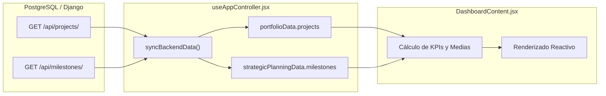

# 📊 Módulo 00: Panel de Control Ejecutivo (Dashboard)

> **Ruta en la aplicación:** `/dashboard` o `/`  
> **Componente principal:** `DashboardContent.jsx`  
> **Controlador:** `useAppController.jsx`  
> **Acceso:** Todos los roles (`Admin`, `User`)  
> **Estado:** 🟢 100% Funcional y reactivo  

---

## 1. 🎯 Propósito y Alcance

El **Dashboard** es el centro neurálgico y punto de entrada visual del sistema. Consolida en una sola pantalla los indicadores clave de rendimiento (KPIs), el avance de cronogramas y los riesgos operativos de la empresa, evitando que los directores o líderes técnicos tengan que revisar módulo por módulo para conocer el estado de la operación.

---

## 2. 🧱 Estructura de la Interfaz (Los 3 Bloques Principales)

El panel se divide en tres secciones jerárquicas:

```
┌────────────────────────────────────────────────────────────────────────┐
│ 1. TARJETAS DE KPIs SUPERIORES (4 métricas ejecutivas en cuadrícula)   │
├──────────────────────────────────────┬─────────────────────────────────┤
│ 2. CALENDARIO SEMESTRAL DE GANTT     │ 3. ALERTAS DE RUTA CRÍTICA      │
│    (Proyectos activos vs meses)      │    (Proyectos en riesgo/pausa)  │
├──────────────────────────────────────┴─────────────────────────────────┤
│ 4. AVANCE POR PROYECTO               │ 5. CONTROL PRESUPUESTARIO       │
│    (Barras de progreso individual)   │    (Gráfico dona Asignado/Usado)│
└──────────────────────────────────────┴─────────────────────────────────┘
```

### 2.1. Bloque 1: Tarjetas de Métricas Ejecutivas (KPIs)
Calculadas en tiempo real mediante funciones de agregación sobre `portfolioData.projects`:

| KPI | Cálculo / Fórmula | Indicador Visual / Badge | Icono |
| :--- | :--- | :--- | :---: |
| **Proyectos Activos** | `projects.filter(p => p.status === 'active').length` | `"{N} en total"` | 📁 `Folder` |
| **Hitos Pendientes** | `milestones.filter(m => m.status === 'pending' \|\| 'upcoming').length` | `"{N} en total"` | ☑️ `CheckSquare` |
| **Presupuesto Total** | $\sum \text{totalBudget}$ formateado en `$K` o `$M` | `"${usado} usado"` | 💲 `DollarSign` |
| **Avance Promedio** | $\frac{1}{N} \sum \text{progress}_i$ | `"{N} prjs"` | 📈 `TrendingUp` |

### 2.2. Bloque 2: Calendario Semestral y Detección de Riesgos
* **Mini-Gantt Semestral (Ene - Jun):** Representa las barras de avance de los primeros 5 proyectos sobre una escala semestral condensada. Incluye un botón de atajo directo **"Ver Planificación"** que dispara `onNavigate('planning')`.
* **Alertas de Ruta Crítica:** Filtra proyectos con estado `status === 'risk'` o `status === 'paused'`.
  * Si existen desviaciones, muestra etiquetas rojas con el nombre del proyecto y su área.
  * Si no hay riesgos, renderiza un estado positivo: `✓ Sin alertas críticas. Todos los proyectos operan con normalidad`.

### 2.3. Bloque 3: Rendimiento y Supervisión Financiera
* **Barras de Avance Individual:** Desglose porcentual con colores diferenciados por proyecto (Cyan, Verde, Naranja, Púrpura).
* **Gráfico de Dona Presupuestaria:** Renderizado mediante `conic-gradient` CSS nativo para evitar librerías pesadas externas, comparando presupuesto total asignado versus ejecutado.

---

## 3. 🔄 Flujo de Datos y Reactividad



1. **Carga inicial:** Al iniciar sesión o refrescar, `useAppController.jsx` consulta `projectsApi.getProjects()` y `projectsApi.getMilestones()`.
2. **Propagación:** Los datos se inyectan en `DashboardContent` mediante las props `portfolioData` y `strategicPlanningData`.
3. **Manejo de Estados Vacíos (*Empty States*):** Si la base de datos no contiene proyectos aún, la vista muestra un mensaje amigable con un botón interactivo **"+ Ir a Portafolio"** para registrar el primer proyecto.

---

## 4. 🎨 Compatibilidad de Temas Visuales (Theme Tokens)

El componente respeta la paleta corporativa y cambia reactivamente según la clase raíz `<html>`:

| Elemento | Modo Claro (`light`) | Modo Oscuro (`dark`) | Modo Medianoche (`midnight`) |
| :--- | :--- | :--- | :--- |
| **Fondo principal** | `bg-slate-50` | `bg-[#0d1117]` | `bg-[#050B14]` |
| **Tarjetas / Cards** | `bg-white border-slate-200` | `bg-[#161b22] border-[#30363d]` | `bg-[#0a1120] border-cyan-900/30` |
| **Títulos / Valores**| `text-slate-900` | `text-white` | `text-cyan-50` |
| **Acentos / Badges** | `text-cyan-600 bg-cyan-50` | `text-cyan-400 bg-cyan-400/10` | `text-cyan-300 bg-cyan-950` |

---

## 5. 🔌 Endpoints y Modelos Asociados

| Recurso | Endpoint | Método | Modelo Django | Campos Utilizados |
| :--- | :--- | :---: | :--- | :--- |
| **Proyectos** | `/api/projects/` | `GET` | `core.Project` | `name`, `status`, `progress`, `budget`, `usedBudget`, `area` |
| **Hitos** | `/api/milestones/` | `GET` | `core.Milestone` | `title`, `status`, `target_date`, `project` |

---

## 6. 🧪 Pruebas y Validación

* **Renderizado:** Comprobado mediante renderizado estático en Node.js y React DOM Server.
* **Cálculo de presupuesto:** Verifica que el formateo de `$K` y `$M` maneje valores nulos sin producir excepciones.
* **Navegación:** Comprueba que los atajos ejecuten las llamadas esperadas a `onNavigate`.
