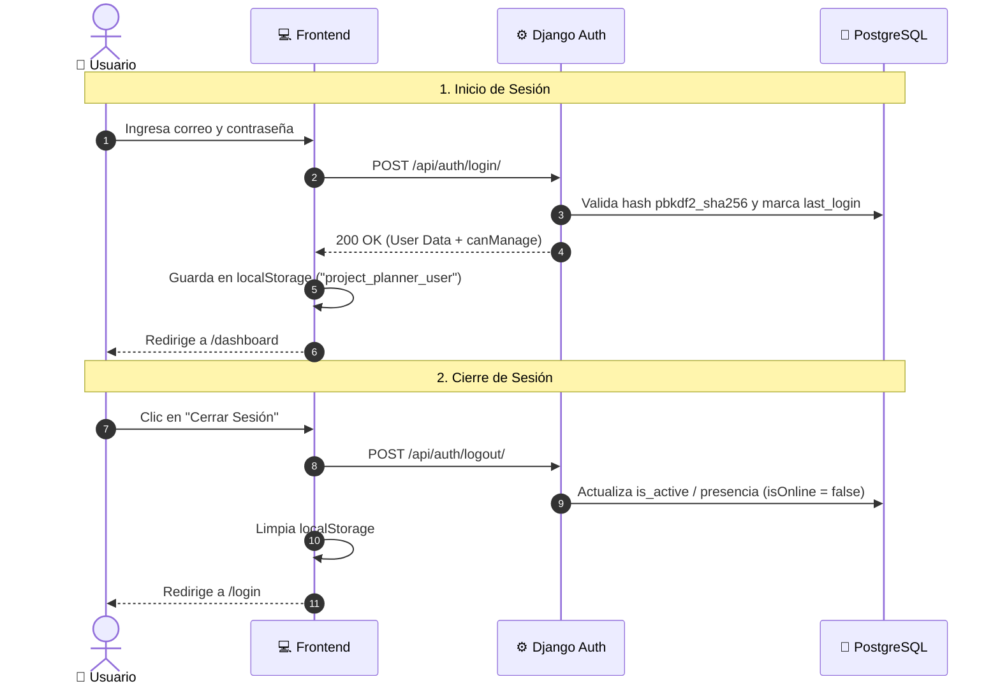

# 🔐 Módulo 01: Autenticación, Seguridad y Roles (RBAC)

> **Rutas en la aplicación:** `/login`, `/roles`, `/configuracion`  
> **Componentes principales:** `LoginScreen.jsx`, `RolesManagement.jsx`, `ProfileControls.jsx`  
> **Controlador y Guards:** `useAppController.jsx`, `navigation.config.js`  
> **Historias de Usuario:** HU-01 (Autenticación y Presencia) y HU-02 (RBAC y Permisos)  
> **Estado:** 🟢 100% Funcional y persistido en PostgreSQL  

---

## 1. 🎯 Propósito y Alcance

Garantiza la seguridad y confidencialidad del sistema gestionando el acceso mediante credenciales encriptadas, determinando los permisos de cada usuario según su rol y monitoreando en tiempo real el estado de presencia (*En línea* / *Desconectado*).

---

## 2. 👥 Matriz de Roles y Niveles de Acceso (RBAC)

El sistema define dos perfiles base con posibilidad de delegación dinámica:

| Rol del Usuario | Nivel Técnico | Vistas Permitidas | Acciones Clave |
| :--- | :---: | :--- | :--- |
| **Project Manager** (`ADMIN`) | Administrador | Todas las rutas (`/dashboard`, `/planning`, `/portfolio`, `/operations`, `/team`, `/human-resources`, `/integrations`, `/roles`, `/configuracion`) | Acceso total, reajuste de cronogramas, aprobación de hitos, alta de proyectos y gestión confidencial de usuarios. |
| **Especialista Técnico** (`USER`) | Operativo | Acceso de consulta y operación (`/dashboard`, `/planning*`, `/portfolio`, `/operations`, `/team`, `/human-resources`, `/integrations`) | Registro de avances y tareas de campo. En `/planning` accede en modo **Solo Lectura** (`canManage = false`). |
| **SubAdministrador** | Delegado | Mismas vistas operativas + permisos de edición en proyectos y cronogramas. | Activado dinámicamente por un Administrador desde `/roles` mediante `canManage = true`. |

---

## 3. 🛡️ Políticas de Navegación y Guards (`navigation.config.js`)

Cada cambio de URL o clic en la barra de navegación es evaluado por funciones de guardia centralizadas:

* **`hasViewAccess(viewId, user)`:** Verifica si el rol del usuario autenticado tiene autorización para la vista destino. Si un usuario no autorizado intenta forzar la URL `/roles`, es interceptado y redirigido al `/dashboard`.
* **`getAllowedSidebarItems(user)`:** Filtra los elementos visibles en el menú lateral. Las opciones administrativas confidenciales quedan completamente ocultas para los usuarios técnicos.

---

## 4. 🔄 Ciclo de Vida de la Sesión y Presencia

---

## 5. 🔌 Endpoints y Modelos Asociados

| Método | Endpoint | Acción / Descripción | Códigos HTTP |
| :---: | :--- | :--- | :---: |
| `POST` | `/api/auth/login/` | Autentica usuario y verifica concordancia de rol. | `200 OK`, `401 Unauthorized` |
| `POST` | `/api/auth/logout/` | Desconecta al usuario y actualiza presencia en base de datos. | `200 OK` |
| `GET` | `/api/auth/users-status/` | Lista usuarios técnicos registrados con su estado real de conexión (`isOnline`). | `200 OK` |
| `PATCH`| `/api/auth/users-status/` | Activa o desactiva la condición de SubAdministrador (`isSubAdmin`). | `200 OK`, `400 Bad Request` |

---

## 6. 🧪 Pruebas Automatizadas

* **Backend (`core/tests.py`):**
  * `test_login_success`: Valida autenticación con credenciales correctas y actualización de sesión.
  * `test_login_invalid_credentials`: Rechazo con HTTP 401 ante contraseñas inválidas.
* **Frontend (`tests/navigation.test.mjs`):**
  * Valida que `hasViewAccess('roles', userTecnico)` retorne `false`.
  * Valida persistencia y limpieza de `localStorage` en `handleLogout`.
