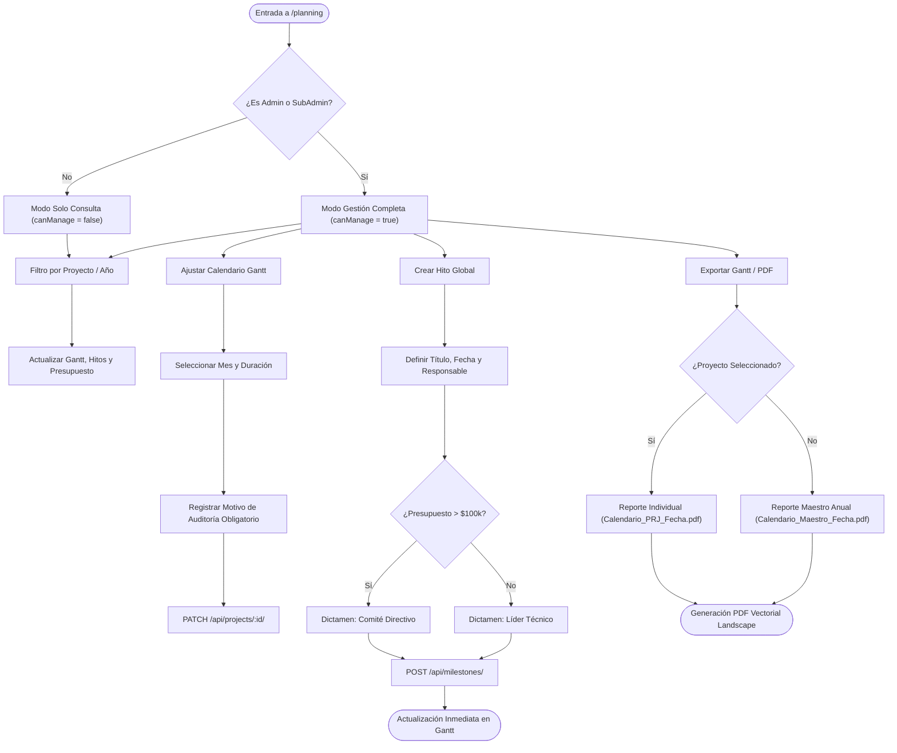

# 🗓️ Módulo 02: Planificación Estratégica (Gantt Maestro e Hitos)

> **Ruta en la aplicación:** `/planning`  
> **Componente principal:** `StrategicPlanning.jsx`  
> **Subcomponentes:** `AdjustScheduleDialog.jsx` (Modal de reajuste)  
> **Controlador:** `useAppController.jsx`  
> **Historias de Usuario:** HU-03 (Calendario Maestro) y HU-04 (Hitos y Regla $100k)  
> **Estado:** 🟢 100% Funcional y persistido en PostgreSQL  

---

## 1. 🎯 Propósito y Alcance

Permite a los Directores de Proyecto y Project Managers planificar el horizonte anual de la organización. Centraliza la asignación de ventanas de ejecución mensual, el establecimiento de hitos estratégicos entregables y la aplicación de reglas de gobernanza corporativa basadas en el presupuesto del proyecto.

---

## 2. ⚙️ Reglas de Negocio Clave

### 2.1. Regla de Gobernanza Presupuestaria (> $100,000)
Todo proyecto dado de alta en la plataforma pasa por una clasificación automática de aprobación:
* **Presupuesto > $100,000 USD:** Requiere obligatoriamente dictamen de **«Revisión por Comité Directivo»**.
* **Presupuesto ≤ $100,000 USD:** Requiere únicamente **«Aprobación Directa por Líder Técnico»**.

### 2.2. Ventana Anual de 12 Meses
* El Gantt se estructura en una cuadrícula fija de 12 meses (Enero a Diciembre).
* Cada proyecto se dibuja mediante una barra horizontal proporcional a su `start_date` (mes de inicio) y `duration_months` (duración en meses).
* La duración máxima está restringida dinámicamente por la fórmula: $\text{maxDuration} = 13 - \text{startMonth}$.

### 2.3. Auditoría Obligatoria en Reajuste de Calendario
Al modificar el cronograma desde el diálogo interactivo `AdjustScheduleDialog`:
* Es mandatorio seleccionar un **Motivo del Reajuste** (ej. *Reasignación de recursos*, *Atraso en permisos municipales*, *Solicitud del cliente*).
* El cambio se persiste vía API y se registra una entrada inmutable en el historial de auditoría.

### 2.4. Filtrado Selectivo y Exportación Ejecutiva a PDF
* **Filtrado Dinámico:** El usuario puede seleccionar un proyecto específico en la barra superior o en la sección de hitos. El sistema filtra en tiempo real el Gantt, la lista de hitos y el panel de control presupuestario para dicho proyecto.
* **Exportación a PDF Vectorial:** Mediante el botón "Exportar Gantt / PDF", se invoca la directiva de impresión ejecutiva `@media print` en orientación horizontal (*landscape*).
  * Oculta automáticamente elementos de navegación (Sidebar, Topbar, botones de acción y selectores interactivos).
  * Despliega un membrete formal con fecha de emisión, título contextualizado y métricas de gobernanza.
  * Asigna dinámicamente el nombre sugerido del archivo con el código del proyecto y la fecha del día (ej. `Calendario_PRJ-2026-001_2026-10-09.pdf`).

---

## 3. 🧭 Flujo de Trabajo del Módulo

---

## 4. Modelo de Datos y Base de Datos

Entidades de PostgreSQL vinculadas en [`core/models.py`](file:///home/ronaldo/Documentos/GitHub/PROJECT%20PLANNER/project-planner/core/models.py):

* **`Project`:** Almacena `start_date`, `end_date`, `duration_months`, `budget`, `status`.
* **`Milestone`:**
  * `project` (ForeignKey a `Project`).
  * `name` (Nombre del hito o entrega).
  * `target_date` (Fecha límite de entrega).
  * `status` (`PENDING`, `IN_PROGRESS`, `COMPLETED`, `DELAYED`).
  * `description` (Alcance técnico).
  * `blocking` (Booleano que indica si bloquea la ruta crítica).

---

## 5. Endpoints y Métodos REST

| Método | Endpoint | Acción / Descripción |
| :---: | :--- | :--- |
| `GET` | `/api/milestones/` | Retorna todos los hitos globales ordenados cronológicamente. |
| `POST` | `/api/milestones/` | Registra un nuevo hito con fecha objetivo y validador. |
| `PATCH`| `/api/milestones/{id}/` | Actualiza estado (ej. de *Pendiente* a *Cumplido*) o fecha. |
| `DELETE`| `/api/milestones/{id}/` | Elimina un hito del calendario. |
| `PATCH`| `/api/projects/{id}/` | Actualiza `start_date`, `end_date` y `duration_months` tras reajuste de Gantt. |

---

## 6. 🧪 Pruebas Automatizadas

* **Backend (`MilestoneStrategicPlanningTests` en `core/tests.py`):**
  * Creación y alias de hitos con campos de frontend.
  * Filtro de hitos por proyecto.
  * Actualización de estados y eliminación en cascada.
* **Frontend (`tests/strategicPlanning.test.mjs`):**
  * Validación de periodos anuales de 1 a 12 meses.
  * Rechazo de reajustes sin motivo de auditoría.
  * Renderizado condicional según privilegios (`canManage = true / false`).
  * Validación de la regla de gobernanza de $100,000 USD.
