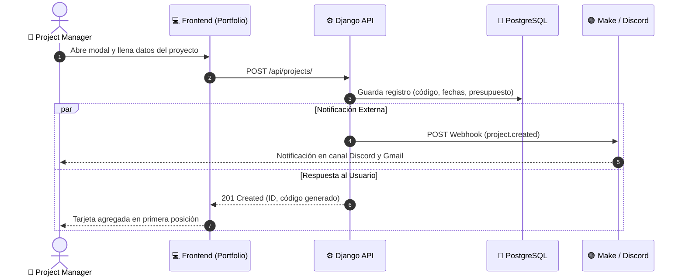

# 💼 Módulo 03: Portafolio de Proyectos y Automatizaciones Make

> **Ruta en la aplicación:** `/portfolio`  
> **Componente principal:** `Portfolio.jsx`  
> **Subcomponentes:** `NewProjectModal.jsx` (Modal de alta)  
> **Controlador:** `useAppController.jsx`  
> **Historias de Usuario:** HU-05 (Creación de Proyectos) y HU-06 (Webhook Make)  
> **Estado:** 🟢 100% Funcional y persistido en PostgreSQL  

---

## 1. 🎯 Propósito y Alcance

Centraliza el repositorio maestro de iniciativas corporativas de la empresa. Permite registrar proyectos con códigos estructurados (`PRJ-YYYY-XXX`), calcular su duración automáticamente, asignar líderes técnicos y emitir eventos automáticos hacia Make (Integromat) para alertar a Discord y Gmail.

---

## 2. ⚙️ Reglas de Negocio Clave

### 2.1. Nomenclatura Estructurada de Código
* Los códigos de proyecto se generan de manera secuencial y estandarizada: `PRJ-{AÑO}-{CORRELATIVO}`, por ejemplo `PRJ-2026-001`, `PRJ-2026-002`.
* Se valida la unicidad del código antes de persistir en PostgreSQL.

### 2.2. Cálculo de Duración y Coherencia de Fechas
* Se valida estrictamente que la fecha de culminación sea posterior a la de inicio (`end_date > start_date`).
* La duración en meses se calcula en base a la diferencia de días calendario: $\text{meses} = \max\left(1, \text{round}\left(\frac{\Delta\text{días}}{30.4}\right)\right)$.

### 2.3. Emisión Resiliente de Webhook (Make / Integromat)
* Al completar la creación vía `POST /api/projects/`, el backend despacha un payload JSON asíncrono con evento `project.created` a la variable de entorno `MAKE_WEBHOOK_URL`.
* **Tolerancia a fallos:** Si Make está fuera de línea o sin conexión, el proyecto se guarda intacto en PostgreSQL sin arrojar error al usuario.

---

## 3. 🧭 Flujo de Creación y Notificación

---

## 4. 🗄️ Modelo de Datos y Base de Datos

* **`Project`:**
  * `code`: Código alfanumérico único (`PRJ-2026-001`).
  * `name`: Nombre descriptivo de la obra o desarrollo.
  * `budget`: Presupuesto total contractual.
  * `start_date`, `end_date`: Fechas límite del cronograma.
  * `duration_months`: Duración calculada en meses.
  * `status`: `PLANNING`, `IN_PROGRESS`, `STAND_BY`, `COMPLETED`, `CANCELLED`.
  * `team_leader`: ForeignKey a `TeamMember`.
  * `technical_area`: ForeignKey a `TechnicalArea` (Civil, Arquitectura, Estructuras, Sistemas).

---

## 5. 🔌 Endpoints y Métodos REST

| Método | Endpoint | Acción / Descripción |
| :---: | :--- | :--- |
| `GET` | `/api/projects/` | Retorna el catálogo completo con filtros y prefetch de líderes. |
| `POST` | `/api/projects/` | Crea nuevo proyecto y dispara el webhook de Make. |
| `GET` | `/api/projects/{id}/` | Detalle exhaustivo de presupuesto y tareas. |
| `PATCH`| `/api/projects/{id}/` | Actualización de estado, avance o presupuesto ejecutado. |
| `DELETE`| `/api/projects/{id}/` | Eliminación de proyecto y sus dependencias. |

---

## 6. 🧪 Pruebas Automatizadas

* **Backend (`core/tests.py`):**
  * Validación de código no repetido.
  * Verificación de persistencia atómica en base de datos.
  * Resiliencia ante webhook inexistente o con timeout.
* **Frontend (`tests/portfolio.test.mjs`):**
  * Cálculo de duración en meses y rechazo de fechas invertidas.
  * Filtrado insensible a mayúsculas y acentos en la barra de búsqueda.
  * Formateo compacto de presupuestos (`$1.2M`, `$450K`).
