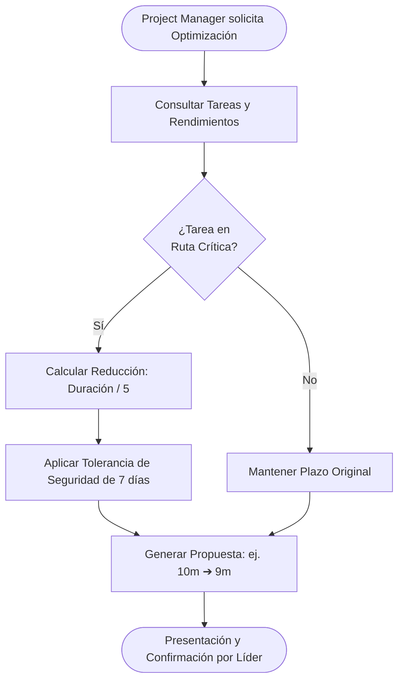

# ⚙️ Módulo 04: Gestión Operativa y Motor de Optimización de Tiempos

> **Ruta en la aplicación:** `/operations`  
> **Componente principal:** `Operations.jsx`  
> **Subcomponentes:** `NewOrderModal.jsx` (Modal de orden de trabajo)  
> **Controlador:** `useAppController.jsx`  
> **Historias de Usuario:** HU-07 (Órdenes de Trabajo) y HU-08 (Motor de Optimización y Holgura 7d)  
> **Estado:** 🟡 85% (Endpoints y motor matemático listos; integración de botón UI en curso)  

---

## 1. 🎯 Propósito y Alcance

Supervisa la ejecución directa de tareas en campo y proporciona un **Motor Algorítmico de Tiempos** capaz de comprimir la duración de proyectos críticos mediante el análisis de rendimientos diarios ($m^2/\text{día}$), ruta crítica y márgenes de seguridad de 7 días.

---

## 2. ⚙️ Algoritmo de Optimización de Cronogramas

El motor de compresión analiza las tareas vinculadas al proyecto y aplica las siguientes reglas arquitectónicas:

### 2.1. Identificación de Ruta Crítica y Holgura
* Solo son comprimibles las tareas con bandera `is_critical_path = True` (holgura nula o negativa).
* Las tareas fuera de la ruta crítica no alteran la fecha final del proyecto.

### 2.2. Fórmula de Reducción y Rendimiento
Para tareas de obra con métricas de rendimiento (ej. encofrados, vaciado de losas, montaje de acero):

$$\text{días\_ahorrados} = \text{round}\left(\frac{\text{duración\_original}}{\text{divisor}}\right)$$

Donde el divisor arquitectónico estándar es **5** (factor de reducción por Fast-Tracking o cuadrillas reforzadas).

### 2.3. Aplicación de Tolerancia de Seguridad (7 días)
* El sistema aplica una holgura protectora de **7 días** (`tolerance_applied_days = 7`) para absorber imprevistos climáticos, retrasos de proveedores o inspecciones.
* La nueva duración final nunca es inferior al piso de seguridad calculado.

---

## 3. 🧭 Flujo de Ejecución del Motor

---

## 4. 🗄️ Modelo de Datos y Base de Datos

* **`Task`:**
  * `project`: ForeignKey a `Project`.
  * `milestone`: ForeignKey opcional a `Milestone`.
  * `name`: Nombre de la orden o labor técnica.
  * `duration_days`: Duración estimada en días hábiles.
  * `is_critical_path`: Booleano (Ruta Crítica).
  * `progress`: Porcentaje de avance físico (0 a 100%).
  * `assigned_to`: ForeignKey a `TeamMember`.
* **`PerformanceMetric`:**
  * `unit`: Unidad de medida ($m^2$, $m^3$, $kg$, etc.).
  * `rate_per_day`: Rendimiento diario estimado.
  * `divisor`: Factor reductor de compresión.

---

## 5. 🔌 Endpoints y Métodos REST

| Método | Endpoint | Acción / Descripción |
| :---: | :--- | :--- |
| `GET` | `/api/tasks/` | Lista las órdenes y tareas operativas. |
| `POST` | `/api/tasks/` | Registra una nueva orden asignada a un especialista. |
| `GET` | `/api/projects/{id}/optimize/` | Ejecuta el algoritmo y devuelve días ahorrados y nueva duración calculada. |
| `POST`| `/api/projects/{id}/optimize/` | Aplica la optimización recalculando las fechas de inicio y fin. |

---

## 6. 🧪 Pruebas Automatizadas

* **Backend (`core/tests.py`):**
  * Validación del cálculo matemático de reducción con divisor 5.
  * Verificación de la aplicación de tolerancia de 7 días.
* **Frontend (`tests/operations.test.mjs`):**
  * Emisión de órdenes con validación de fechas e inserción prioritaria.
  * Exportación del reporte de despacho operativo.
