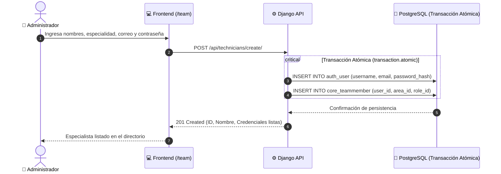

# 👥 Módulo 05: Directorio Técnico, Recursos Humanos y Disponibilidad

> **Rutas en la aplicación:** `/team`, `/human-resources`  
> **Componentes principales:** `TechnicalTeam.jsx`, `HumanResources.jsx`  
> **Controlador:** `useAppController.jsx`  
> **Historias de Usuario:** HU-09 (Alta Conjunta de Técnicos) y HU-10 (Matriz de RRHH e Incidencias)  
> **Estado:** 🟢 90% (Backend 100% y alta atómica; integración final de UI local de incidencias)  

---

## 1. 🎯 Propósito y Alcance

Administra el capital humano de la empresa organizándolo en dos vertientes:
1. **Directorio Técnico (`/team`):** Agrupación por especialidades de ingeniería (Civil, Arquitectura, Estructuras, Sistemas), proyectos asignados y carga operativa.
2. **Recursos Humanos (`/human-resources`):** Control de nómina, estados contractuales, cálculo de días hábiles en licencias o incidencias y exportación a CSV.

---

## 2. ⚙️ Reglas de Negocio Clave

### 2.1. Alta Atómica (Técnico + Cuenta de Acceso)
Para evitar discrepancias entre personal registrado y usuarios del sistema:
* El formulario de alta en `/team` despacha una transacción atómica que crea simultáneamente:
  1. Un registro de autenticación `auth.User` con contraseña encriptada.
  2. Una ficha de colaborador `core.TeamMember` vinculada a su área técnica.
* Si el correo ya existe, la transacción se aborta (`HTTP 400`) impidiendo registros corruptos.

### 2.2. Estados de Disponibilidad
Los colaboradores se clasifican en tres estados operativos:
* **Active:** Asignado a proyectos y disponible para despacho.
* **Stand-by:** En espera de inicio de nueva fase u obra.
* **Support:** Apoyo transversal a múltiples proyectos simultáneos.

### 2.3. Cálculo Automático de Días Hábiles
Al registrar una ausencia médica o permiso, el sistema excluye automáticamente fines de semana (sábados y domingos) para calcular el impacto real sobre la capacidad laboral.

---

## 3. 🧭 Flujo de Alta Conjunta de Especialistas

---

## 4. 🗄️ Modelo de Datos y Base de Datos

* **`TeamMember`:**
  * `user`: OneToOneField a `auth.User`.
  * `name`: Nombre y apellidos.
  * `email`: Correo corporativo único.
  * `technical_area`: ForeignKey a `TechnicalArea` (Civil, Arquitectura, Estructuras, Sistemas).
  * `role`: ForeignKey a `Role` (Líder Técnico, Especialista, Supervisor).
  * `status`: ForeignKey a `TeamStatus` (Active, Stand-by, Support).
  * `availability`: Porcentaje de dedicación libre (0 a 100%).

---

## 5. 🔌 Endpoints y Métodos REST

| Método | Endpoint | Acción / Descripción |
| :---: | :--- | :--- |
| `GET` | `/api/team-members/` | Lista especialistas con sus proyectos asociados. |
| `POST` | `/api/technicians/create/` | Alta atómica de usuario `User` + `TeamMember`. |
| `GET` | `/api/technical-areas/` | Catálogo de disciplinas técnicas de la empresa. |
| `GET` | `/api/team-statuses/` | Catálogo de estados de disponibilidad. |

---

## 6. 🧪 Pruebas Automatizadas

* **Backend (`core/tests.py`):**
  * `test_create_technician_atomic`: Valida creación sincronizada de usuario y técnico.
  * `test_duplicate_email_rejected`: Valida integridad y rechazo de correos duplicados.
* **Frontend (`tests/technicalTeam.test.mjs` y `tests/humanResources.test.mjs`):**
  * Filtrado combinado de búsqueda y área técnica sin distinción de tildes.
  * Exportación de la nómina completa en formato CSV estándar.
  * Cálculo de días calendario vs. días hábiles en incidencias.
