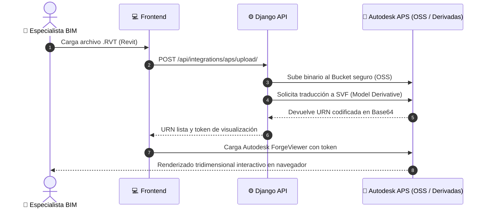

# 🌐 Módulo 06: Integraciones Externas (Drive, Make y Autodesk BIM APS 3D)

> **Ruta en la aplicación:** `/integrations`  
> **Componentes principales:** `Integrations.jsx`, visor 3D `ForgeViewer`  
> **Controlador:** `useAppController.jsx`  
> **Historias de Usuario:** HU-06 (Make Webhook), HU-11 (Google Drive API), HU-12 (Autodesk APS Revit)  
> **Estado:** 🟢 100% Funcional e integrado  

---

## 1. 🎯 Propósito y Alcance

Permite la conectividad fluida de Project Planner con el ecosistema de herramientas corporativas de terceros:
1. **Make (Integromat):** Despacho automatizado de alertas hacia Discord y Gmail.
2. **Google Drive API:** Repositorio en la nube para adjuntar memorias de cálculo, planos y especificaciones.
3. **Autodesk Platform Services (APS / Forge):** Bóveda BIM con visor WebGL interactivo en 3D para modelos nativos de Revit (`.RVT`).

---

## 2. ⚙️ Arquitectura de los Conectores

### 2.1. Conector Make (Integromat)
* Permite enviar webhooks al crear proyectos o finalizar tareas clave.
* Incluye un botón de **diagnóstico en vivo** (`POST /api/integrations/make/test/`) para validar latencia y estado del canal en tiempo real.

### 2.2. Conector Google Drive (OAuth2 y Multipart)
* Autenticación segura mediante flujo OAuth2 (`/api/integrations/google-drive/connect/`).
* Subida directa de archivos en formato `multipart/form-data` a carpetas parametrizadas del proyecto.

### 2.3. Bóveda BIM y Visor 3D (Autodesk APS)
* Permite subir modelos `.RVT`, generar su traducción a formato SVF (*Model Derivative API*) y renderizarlos en el navegador con WebGL.
* Capacidades interactivas: orbitar, hacer zoom, cortes axiales, ocultar capas y explorar árboles de propiedades BIM.

---

## 3. 🧭 Flujo de Carga y Visualización de Modelos Revit (APS 3D)

---

## 4. 🗄️ Modelo de Datos y Credenciales

* **Variables de entorno (`.env`):**
  * `MAKE_WEBHOOK_URL`: Endpoint receptor de Make.
  * `GOOGLE_DRIVE_CLIENT_ID`, `GOOGLE_DRIVE_CLIENT_SECRET`: Credenciales OAuth2.
  * `APS_CLIENT_ID`, `APS_CLIENT_SECRET`, `APS_BUCKET_KEY`: Credenciales Autodesk Platform Services.
* **`DriveLink`:**
  * `task` / `project`: Clave foránea al recurso correspondiente.
  * `file_name`: Nombre visible del entregable.
  * `drive_url`: Enlace directo al visor web de Google Drive.

---

## 5. 🔌 Endpoints y Métodos REST

| Servicio | Método | Endpoint | Acción / Descripción |
| :--- | :---: | :--- | :--- |
| **Make** | `GET` | `/api/integrations/make/status/` | Verifica si el webhook está configurado. |
| **Make** | `POST`| `/api/integrations/make/test/` | Envía evento de prueba para verificar conectividad. |
| **Google Drive** | `GET` | `/api/integrations/google-drive/connect/` | Inicia el flujo de autorización OAuth2. |
| **Google Drive** | `POST`| `/api/integrations/google-drive/upload/` | Sube un archivo multipart a la carpeta técnica. |
| **Autodesk APS** | `GET` | `/api/integrations/aps/token/` | Obtiene un token temporal seguro de lectura. |
| **Autodesk APS** | `POST`| `/api/integrations/aps/upload/` | Sube un `.RVT` y solicita traducción a SVF. |

---

## 6. 🧪 Pruebas Automatizadas

* **Backend (`core/tests.py`):**
  * Validación de resiliencia ante falta de credenciales externas.
  * Pruebas de obtención de token APS y traducción de URNs.
* **Frontend (`tests/integrations.test.mjs`):**
  * Inicio del panel con las tres integraciones activas y tarjetas de estado.
  * Búsqueda y filtrado de eventos y actividades sin sensibilidad a tildes.
  * Pruebas de simulación y registro de eventos de conectividad.
